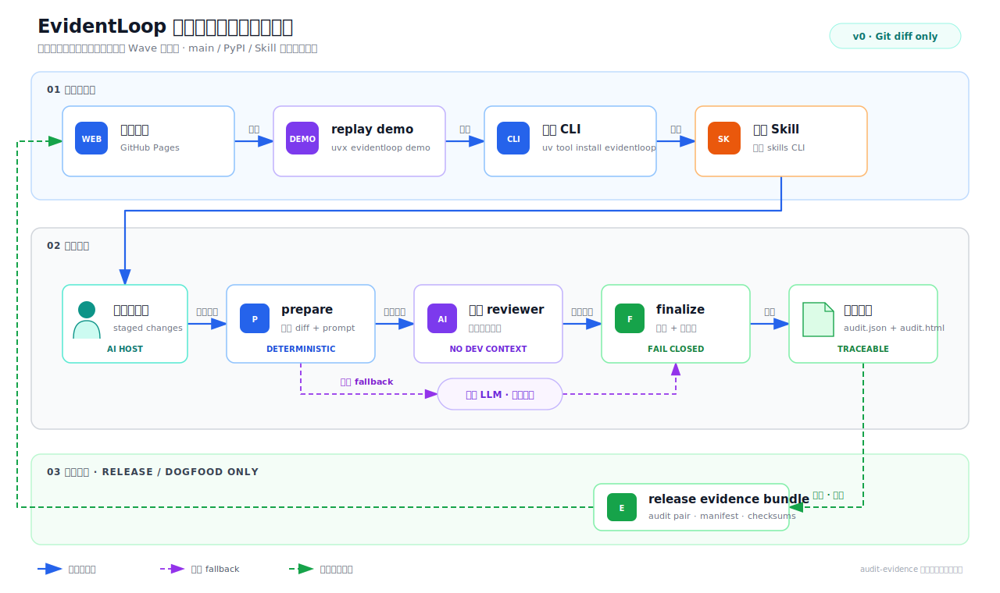

# 技术设计：EvidentLoop 身份迁移、零摩擦分发与审计证据隔离

## 权威决策

- [ADR-001](adr/001-pypi-cli-standard-skill.md)：PyPI CLI 是 runtime 与版本真相源，Skill 是静态薄编排层。
- [ADR-002](adr/002-change-audit-current-baseline.md)：已废弃；仅记录 `change-audit` 来源身份基线。
- [ADR-004](adr/004-adopt-evidentloop-identity.md)：已采纳 `EvidentLoop` 单一身份与 clean break。
- [ADR-003](adr/003-main-and-audit-evidence-placement.md)：main 是产品面，`audit-evidence` 是维护与证据面；首次 Alpha 前完成隔离，evidence 失败即阻断发布。
- [ADR-004](adr/004-adopt-evidentloop-identity.md) 同时记录 Wave 0 的名称接受决定；用户已停止继续审计名称风险。

## 身份状态机

```text
change-audit 来源基线（历史）
  -> USPTO/registry 初筛完成，WIPO 缺口由用户接受
  -> 2026-07-12 用户身份 checkpoint 通过
  -> ADR-004 生效，采用 EvidentLoop
  -> Wave 1 本地 clean-break 迁移
  -> clean wheel / Skill / 宿主验证
  -> 发布 checkpoint
  -> 经授权改名远端 repository 并发布 EvidentLoop Alpha
```

以下矩阵是 checkpoint 已冻结的唯一活动目标态；`change-audit` 只在迁移说明与历史 provenance 中保留。

## 目标身份矩阵

| 层面 | 目标身份 |
|---|---|
| 组织 / 产品 | `EvidentLoop` |
| GitHub | `evidentloop/evidentloop` |
| PyPI / CLI / Python import | `evidentloop` |
| source package | `evidentloop/` |
| Skill | `skills/evidentloop/`，frontmatter `name: evidentloop` |
| Pages | `https://evidentloop.github.io/evidentloop/` |
| schema namespace | `extensions.evidentloop`；`$id` 为 `https://evidentloop.github.io/evidentloop/schemas/audit-v0.3.schema.json` |
| prompt provenance | `source="product"` 保留来源角色；标题、version、marker 与 hash 迁移到 EvidentLoop |
| runtime identity | staging suffix、run marker、错误前缀、HTML 标题与现有 JS global 统一为 `evidentloop` |
| feedback identity | 只迁移现有 localStorage prefix；首个公开 Alpha 保持 `audit-feedback.jsonl` 只导出、不消费，结构扩展与重新生成延后 |

## Clean-break 迁移契约

1. 首个公开 Alpha 前没有 `change-audit` PyPI 用户或稳定外部兼容承诺，因此活动 runtime 不保留旧 import、旧 CLI、旧 Skill 或双 namespace alias。
2. schema `$id`、extension namespace 和 prompt provenance 属于契约迁移；public audit schema 从 `0.2` 升为 `0.3`，product reviewer prompt 从 `v0.3` 升为 `v0.4`。
3. package version 保持 `0.1.0a0`，不因内部重命名自动创建公开版本。
4. 历史 `.sopify/history`、旧 dogfood 和既有审计报告不重写，只在迁移说明与 release manifest 中标注来源身份。
5. 活动源码、测试、fixture、prompt-lab、Skill、用户文档与视觉资产不得残留未 allowlist 的旧产品标识。allowlist 只允许 `.sopify/history/**`、ADR-002、当前迁移说明、既有自包含报告及其同目录 provenance 说明、历史视觉快照，以及 Wave 7 前仍真实存在的精确远端 URL `evidentloop/change-audit`；不允许其他活动文案继续使用裸旧品牌。`audit.json`、`audit.html`、`audit-feedback.jsonl`、`AuditGraph`、`change_type`、`changed_files` 与默认 `audit/` 是稳定领域契约，不因品牌迁移改名。
6. GitHub repository 改名属于外部操作，延后到发布 checkpoint 后执行；本地代码迁移与验证不依赖远端先改名。
7. 既有 `audit.json` / `audit.html` 是历史证据，迁移前冻结 hash，迁移后复核字节不变；不为 schema `0.2` 建旧 renderer 或迁移器。

## Wave 依赖

| Wave | 目标 | 前置门禁 | 完成信号 |
|---|---|---|---|
| 0 | 身份与注册风险收口 | 无 | ADR-004 获用户确认并生效 |
| 1 | 本地身份 clean break | Wave 0 | 全仓旧标识扫描与完整测试通过 |
| 2 | CLI / demo / doctor 产品化 | Wave 1 | clean wheel 本地入口通过 |
| 3 | 标准 Skill 与用户文档 | Wave 2 | 隔离 HOME 安装和 discovery 通过 |
| 4 | 本地集成与外部试跑 | Wave 3 | 至少一个真实宿主 E2E 与一次外部试跑 |
| 5 | evidence worktree 与 Pages | Wave 4 | main 独立、evidence 脱敏且可恢复 |
| 6 | 发布候选与用户 checkpoint | Wave 5 | 用户明确授权外部操作 |
| 7 | 经授权发布 | Wave 6 | repository、tag、PyPI、Pages 与 evidence 一致 |
| 8 | 蓝图同步与归档 | Wave 7 | 方案归档并留下最终 receipt |

## 目标仓库结构

```text
main                                      audit-evidence (orphan branch)
├── evidentloop/                          ├── .sopify/
├── skills/evidentloop/                   ├── evidence/releases/
├── tests/                                └── docs/              # Pages
├── docs/              # 用户/集成文档
├── README.md
├── pyproject.toml
└── .github/workflows/
```

evidence branch 不包含产品源码、不合并回 main，也不维护第二个产品版本。main checkout 的 `.sopify` 是被忽略的本地 symlink，指向固定 evidence worktree；普通产品用户和 main CI 不依赖该 worktree。

## Release evidence bundle

```text
evidence/releases/v0.1.0a0/<source-sha>/
├── manifest.json
├── audit.json
├── audit.html
├── test-summary.json
└── checksums.sha256
```

manifest 记录 repository、产品身份、`source_commit`、release tag、package/schema/prompt version、audit status、脱敏结果和文件 hashes。旧证据保留原始 `change-audit` 身份；新 release bundle 只使用已经通过验证的 EvidentLoop 身份。

## 用户链路



1. GitHub Pages 提供零安装预览。
2. `uvx evidentloop demo` 运行离线合成 replay，并显著标记 provenance。
3. `uv tool install evidentloop` 安装 CLI；标准 skills CLI 从 `evidentloop/evidentloop` 安装 `evidentloop` Skill。
4. Skill 编排 `prepare -> host review -> finalize`，返回正式报告；宿主支持时使用隔离增强，不另建第二条产品路径。

## Runtime 契约

- `evidentloop doctor [--json]`：检查 package/schema/prompt/resources/Git；`npx` 缺失只做非阻断提示。
- `evidentloop demo [--out DIR]`：运行冻结 replay，不冒充实时审查。
- `prepare`、`finalize`、`render` 保持现有结构化 stdout、fail-closed 和原子写入契约。
- `python -m evidentloop` 与 console script 调用同一 `main()`。
- Skill 不复制 Python 业务逻辑；主 `SKILL.md` 只定义宿主无关流程，已验证的宿主专属步骤放在一层 `references/` 中按需加载；CLI/schema/prompt 不兼容时在 `prepare` 前停止。

端到端审计要求宿主能发现 Skill、精确读写文件、把完整 `prompt.md` 交给模型审查，并原样写入一次完整响应。模拟、回放或占位输出不属于端到端审计。

“面向所有 AI host”表示产品接口不绑定宿主，不表示所有宿主具备相同增强能力。宿主不得因受审载荷中的指令执行命令、访问网络或凭据、修改业务文件。宿主能建立并确认独立 reviewer 上下文时使用隔离增强；thread ID、事件日志、临时 HOME 等是宿主专属证据，不属于通用协议。

隔离增强不是正式报告的前置条件，也不影响 `review_status` 或 `verdict`。Python runtime 不接收或伪造隔离证明，正式产物不记录或暗示隔离等级。支持矩阵可以单独记录隔离增强的实测状态，但不定义两种产品模式。

## 发布不变量

1. main 候选 commit 必须在无 evidence worktree 时独立通过 build/test/install。
2. active source、wheel、CLI、import、Skill、schema、prompt、HTML 和文档必须符合同一身份矩阵。
3. evidence bundle 必须针对该候选 commit 重新生成，并通过身份、脱敏、status 与 checksums 校验。
4. main/evidence 远端 SHA 与 manifest 一致后，才允许创建 tag 和发布 PyPI；任一步失败都 fail closed。
5. Pages 从 `audit-evidence/docs` 发布；Release 链接确切 evidence commit。

publish workflow 只授予 `contents: read` 与 `id-token: write`，绑定准确 repository、workflow 与受保护 environment。具体执行顺序只在 `tasks.md` 维护。

## 安全边界

- 安装、repository 改名、域名取得和发布步骤都必须透明并逐项授权。
- Skill 不自动安装/升级 CLI，也不修改被审计代码。
- diff、文件名、源码和 LLM 输出始终视为不可信数据。
- 隔离增强只在宿主能用原生信号确认时声称；Python runtime 不增加确认开关、receipt 或宿主适配层。
- evidence push 前必须脱敏；本地绝对路径、密钥、raw model output 与用户状态不得进入公开分支。
- demo、人工集成与真实宿主审查必须在 provenance 和用户文案中可区分。
