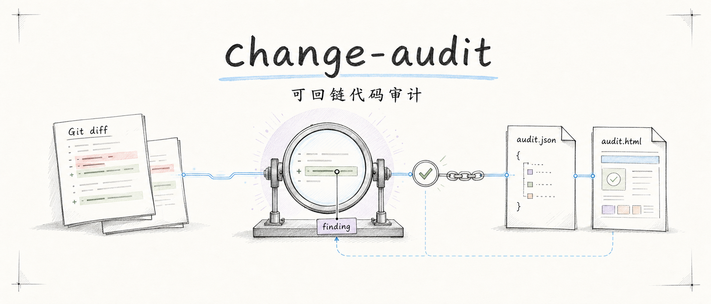

<h1 align="center">change-audit</h1>

<p align="center"><strong>Traceable code review for local Git diffs.</strong></p>

<p align="center">
  <a href="./README.md">English</a> ·
  <a href="./README.zh-CN.md">简体中文</a>
</p>

<p align="center">
  
  
  
</p>



`change-audit` turns a review of a local Git diff into two artifacts you can inspect and keep: a validated `audit.json` and a self-contained `audit.html`. A scored finding must resolve to a real changed line. Incomplete or malformed reviews stay visibly incomplete.

> [!IMPORTANT]
> The repository is a local Alpha (`0.1.0a0`). There is no PyPI release, release tag, or `change-audit` console script yet. The instructions below use a local checkout and `python -m change_audit`.

## What you get

| Artifact | Role |
|---|---|
| `audit.json` | Validated machine-readable source of truth, including the complete trusted hunks and graph relationships. |
| `audit.html` | Self-contained Chinese report with bounded code evidence, changed-line highlights, and browser-local decisions. |
| `audit-feedback.jsonl` | Optional export of human decisions; the Alpha does not consume it or edit code. |

Three rules shape the product:

- Findings are checked against the Git diff parsed by Python; the reviewer cannot invent trusted paths, hunks, IDs, fingerprints, or scores.
- JSON and HTML are validated and published as one artifact pair. A hard failure cannot leave a half-report that looks successful.
- `complete` means the reviewer returned the complete output contract. It does not claim complete behavioral coverage or “all bugs found.”

## See a real report

The checked-in [Fireworks Tech Graph dogfood](./docs/examples/dogfood-fireworks-tech-graph/) was regenerated after implementation from this exact range:

```text
d5ef26deac6b1ed37ee9b89b52dddb1bcaac6c24..9a64e5a926d430a421a71b5cf433b0553876db28
```

It covers 21 files and 52 hunks, with 7 findings anchored to real added lines and 0 unscored findings. The final state is `complete + concerns`; its diagnostics still report partial intent coverage and `0.65` pack completeness.

- Open the [self-contained HTML report](./docs/examples/dogfood-fireworks-tech-graph/audit.html).
- Inspect the [canonical audit.json](./docs/examples/dogfood-fireworks-tech-graph/audit.json).
- Read the [generation record](./docs/examples/dogfood-fireworks-tech-graph/README.md) and [same-source baseline comparison](./docs/examples/dogfood-fireworks-tech-graph/baseline-comparison.md).

The report is evidence of the implemented pipeline, not a claim that the reviewer found every defect in the range.

## Local quick start

Requirements: Git, Python 3.10 or newer, and an AI host that can run a local Agent Skill and create an isolated reviewer context.

```bash
git clone https://github.com/evidentloop/change-audit.git
cd change-audit
python3.11 --version       # use any installed Python >=3.10
python3.11 -m venv .venv
source .venv/bin/activate
python -m pip install -e .
python -m change_audit --help
```

Register the entire [`integrations/agent-skill/change-audit/`](./integrations/agent-skill/change-audit/) directory with your host's local Skill mechanism. Do not copy only `SKILL.md`: the bundle also contains host metadata. This Alpha does not yet ship a verified cross-host installer or a maintainer-published fixed tag for external installation.

Then, inside the Git repository you want to inspect, ask your host:

```text
Use change-audit to audit my staged changes and generate the HTML report.
```

Or in Chinese:

```text
帮我用 change-audit 审计 staged changes，并生成 HTML 报告。
```

The Skill checks package/schema compatibility, prepares a trusted workspace, sends only the generated review prompt to an isolated host reviewer, finalizes the artifact pair, and returns the report paths. The current report UI and reviewer prose are Simplified Chinese; English natural-language triggering does not imply English report localization.

## How it works

```text
natural-language request
  → Agent Skill resolves repository and diff scope
  → Python prepare freezes Git evidence and prompt provenance
  → isolated host reviewer returns semantic findings
  → Python verifies changed-line anchors and builds the Audit Graph
  → schema, semantics, trace links, and HTML pass validation
  → audit.json + audit.html are published together
  → optional browser-local feedback export
```


The default Python path does not call a model SDK or manage API keys. Diff text, source, comments, filenames, and reviewer output are treated as untrusted data; review payloads are never executed.

## Host integrator commands

Most users should use the Skill. Integrators can use the three module commands directly:

```bash
# 1. Creates a hidden staging workspace and prints a JSON locator.
python -m change_audit prepare --diff staged --out audit/20260710_example

# 2. The host opens locator.prompt_path in a fresh isolated reviewer context
#    and writes the reviewer's exact response to locator.raw_analysis_path.

# 3. Validates and publishes the formal pair; the final directory must not exist.
python -m change_audit finalize --out audit/20260710_example

# Independent re-render from an existing validated JSON artifact.
python -m change_audit render \
  audit/20260710_example/audit.json \
  --out audit/20260710_example/audit.html
```

`review` is a Skill action, not a Python command. `prepare` and `finalize` are not a meaningful two-command shortcut: an isolated host review must write the exact raw result between them. Explicit `render --out` authorizes replacement of that HTML file only and never modifies `audit.json`.

The public Python entry points are available from `change_audit.api`:

```python
from change_audit.api import finalize_review, prepare_local_diff, render_audit_file
```

See [AI host integration](./docs/ai-host-integration.md) for the locator contract, failure handling, prompt boundary, and installation consent rules.

## Current scope

| Capability | Alpha status |
|---|---|
| Local Git `staged`, `unstaged`, ref, and range diffs | Implemented |
| Added, modified, deleted, renamed, and binary-file metadata | Implemented |
| `code_diff` schema and self-contained HTML | Version `0.2` |
| Exact add/delete-line anchors and bounded trusted hunk excerpts | Implemented |
| Complete, partial, failed, and inconclusive states | Implemented |
| Browser-local decisions and JSONL export | Implemented; not consumed |
| Codex end-to-end dogfood | Completed on the Fireworks range above |
| Qoder model-level smoke | Deferred for manual verification; not claimed as passed |
| Report language | Simplified Chinese in v0 |
| Folder diff, file-only review, or remote PR URL | Not supported |
| Automatic fixes, command execution, or feedback ingestion | Not supported |
| PyPI package, release tag, or console script | Not published |

The internal `change_audit.review` subsystem is artifact-general by direction, but a new artifact type is not a formal audit profile until it has an adapter, trusted anchors, an evaluation baseline, and a renderer profile. Schema `0.2` is specifically the code-diff profile.

## Development

```bash
python -m pip install -e '.[dev]'
python -m pytest -q
python -m ruff check .
python -m build
```

Useful references:

- [V0 scope](./docs/v0-scope.md)
- [Data model](./docs/data-model.md)
- [AI host integration](./docs/ai-host-integration.md)
- [Hunk rendering reference](./docs/examples/hunk-context-demo/)
- [Real Fireworks dogfood](./docs/examples/dogfood-fireworks-tech-graph/)

## License

Licensed under the [MIT License](./LICENSE).
