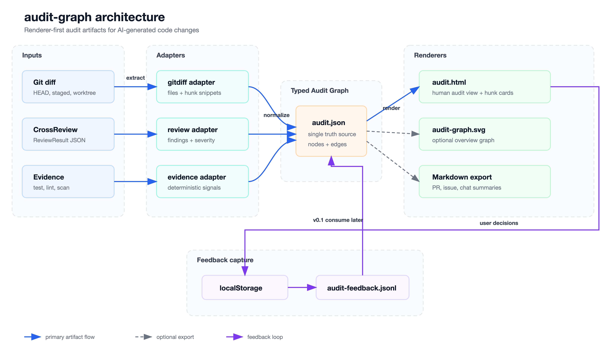
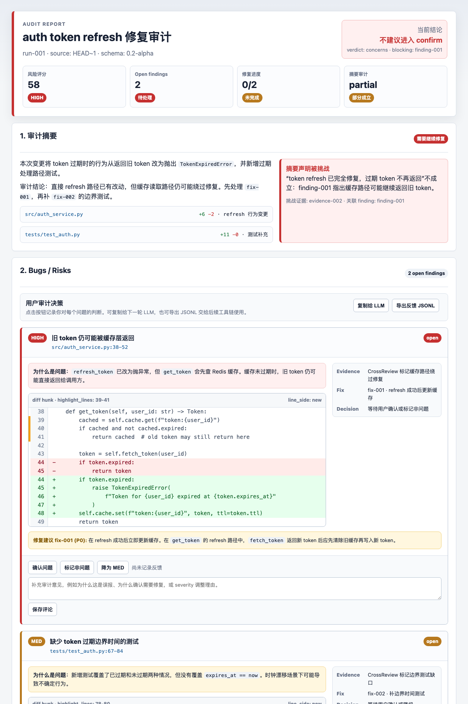

# audit-graph

Audit trail for AI-generated code changes.

[简体中文](README.zh-CN.md)

AI coding tools generate code fast. AI review tools catch issues fast. But the audit trail — what changed, what was reviewed, what was accepted, what is still open — lives in scattered chat logs and terminal output. When a human finally reads the report, the context is gone.

`audit-graph` collects review evidence into two auditable artifacts: a machine-readable graph (`audit.json`) and a self-contained HTML audit page (`audit.html`) with code context, evidence links, and user decision controls.

```text
AI coding diff + review signals → audit.json → audit.html → human decision JSONL
```



## Status

Design and data model are defined. Implementation has not started.

## Who Is This For

- **AI coding teams** who need to verify AI-generated code before merging, not just trust the review summary.
- **Workflow builders** embedding audit checkpoints into AI coding pipelines like Sopify.
- **Solo developers** who want a structured audit view after AI generates and reviews their code.

## What It Does Not Do

`audit-graph` does not generate findings, run tests, or decide whether code is correct. It visualizes review signals from other tools and makes them traceable.

## Target Output

v0 target HTML shape — design reference, not yet implemented.



## Inputs and Outputs

| Direction | File | Description |
|-----------|------|-------------|
| IN | Git diff / staged / unstaged | Change source |
| IN | CrossReview `ReviewResult` JSON | Review findings |
| IN | Test / lint / typecheck / scan results | Deterministic evidence |
| OUT | `audit.json` | Machine-readable audit graph (source of truth) |
| OUT | `audit.html` | Self-contained human audit view |
| OUT | `audit-feedback.jsonl` | User decision records (v0 capture only) |
| OUT | `audit-graph.svg` | Optional risk overview graph |
| OUT | Markdown | Non-default export for PR or chat |

## What It Audits

Three review questions:

- **Change understanding**: what changed, which files were affected, whether the implementation matches the original intent.
- **Issue review**: bugs, risks, missing edge cases, failed evidence, which findings require fixes.
- **User decisions**: accept, false positive, severity override, or add context.

An AI coding task may go through multiple rounds of generation, review, fix, and re-review. `audit-graph` records that convergence process.

## V0 Shape

Two CLI commands:

```text
audit-graph build    # produce audit.json from diff + review inputs
audit-graph render   # produce audit.html from audit.json
```

Each finding is rendered as a card with title, source location, hunk snippet with highlight lines, evidence chain, fix suggestions, and user decision controls. The static HTML uses localStorage to persist feedback and export `audit-feedback.jsonl`.

## Related Projects

- [cross-review](https://github.com/evidentloop/cross-review): independent second-pass review.
- [tech-report](https://github.com/sateful-ai/tech-report): narrative technical report generation.
- [sopify](https://github.com/evidentloop/sopify): workflow orchestration and checkpoints.

## License

MIT
