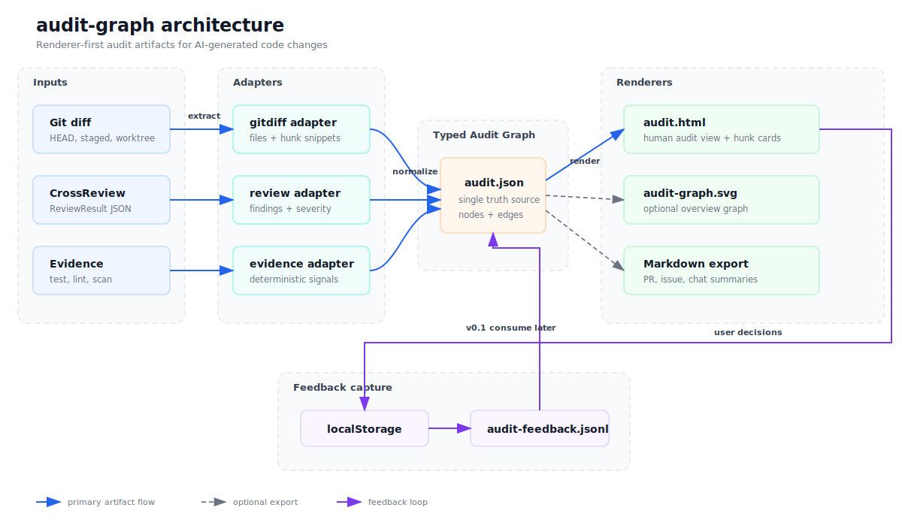

# audit-graph

面向 AI 技术变更的可视化审计证据图谱。

[English](README.md)



`audit-graph` 把审查信号转成可审计产物：机器可读图谱和带代码上下文的 HTML 审计页。它可以独立使用，也可以消费 CrossReview 等工具的输出。SVG 是可选概览图，不是默认主界面。

## 当前状态

规划脚手架。当前未添加实现代码。

## 核心定位

`audit-graph` 是独立优先、可嵌入工作流的审计可视化工具。

- 独立使用：对本地 Git diff、staged changes 或 unstaged changes 生成审计视图。
- 工作流使用：嵌入 Sopify 等 AI coding 流程，在 develop、review、audit、confirm、finalize 之间提供可视化 checkpoint。

## 产品边界

`audit-graph` 不判断代码一定正确；它负责让审查证据可见、可追踪、可度量。

## 审计对象

`audit-graph` 覆盖两类审计问题：

- 变更理解：这次任务改了什么、影响哪些文件或模块、实现路径是否符合原始意图、还有哪些地方值得继续优化。
- 问题审查：有没有 bug、风险、遗漏边界或失败证据，哪些 finding 需要修复，修完后风险是否下降。
- 用户决策：用户是否认可 finding、是否认为它是误报、是否需要调整 severity 或补充上下文。

一次 AI coding 任务可能会经历多轮生成、审查、修复和再审查。`audit-graph` 的长期目标是记录这个收敛过程，而不是只生成一份事后报告。

## 计划产物

- `audit.json`：机器可读真相源，供 CLI、Sopify、tech-report 和后续 renderer 消费。
- `audit.html`：默认人类审计视图，承载变更摘要、finding hunk snippet、修复方案、多轮对比、证据详情和用户反馈采集。
- `audit-feedback.jsonl`：由 `audit.html` 导出的用户审计决策。v0 只采集，不消费。
- `audit-graph.svg`：可选概览图，用于 HTML 顶部、PR 插图或报告嵌入，只展示风险分布和关键链路。
- Markdown：非默认产物。仅在需要粘贴到 PR、Issue 或聊天窗口时，从 `audit.json` 导出摘要或修复清单。

## 计划输入

- Git diff、staged changes 或 unstaged changes。
- CrossReview `ReviewResult` JSON。
- 测试、lint、typecheck、安全扫描等确定性证据摘要。

## V0 形态

V0 默认生成带 hunk context 的 `audit.html`。每个 finding 使用卡片展示：标题、位置、关键代码 snippet、证据、修复建议和用户决策控件。

`audit.json` 保存 finding 的 `file_path`、`start_line`、`end_line`、`line_side`、`highlight_lines`、`hunk` 和 `fingerprint`。本地编辑器跳转链接由 renderer 生成，不写入 `audit.json`。

静态 HTML 可以使用 JavaScript + localStorage 暂存用户反馈，并导出 `audit-feedback.jsonl`。后续版本再消费该文件影响下一轮审计。

## 与相邻项目的关系

- `cross-review`：独立二次复核。
- `audit-graph`：证据图谱和可视化审计层。
- `tech-report`：叙事型技术报告生成。
- `sopify`：工作流编排和 checkpoint。

## SVG 策略

`audit-graph` 只做一种可选图：Audit Graph。

它可以借鉴通用 SVG diagram skill 的模板、转义和 XML 校验机制，但不追求多图种、多风格或图标库泛化。第一版 SVG 应该稳定表达：

```text
change -> files -> findings -> evidence / fixes
```

SVG 不承载完整审计详情。完整阅读、筛选、修复跟踪、用户反馈和多轮对比由 `audit.html` 承担。
