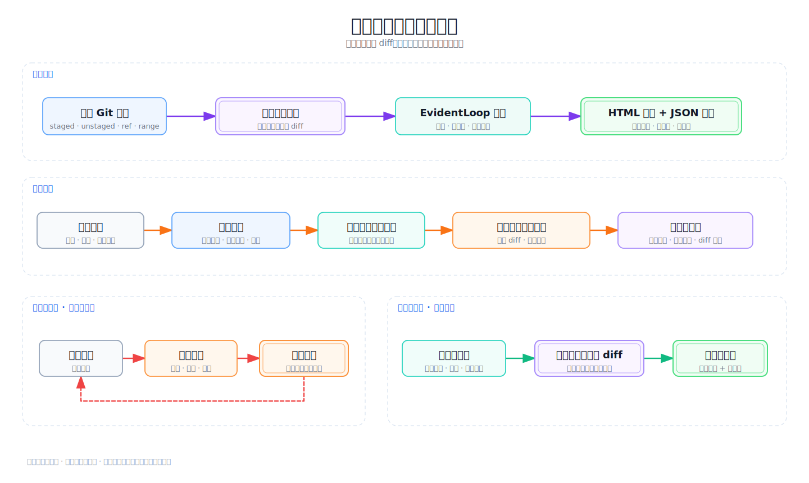

<h1 align="center">EvidentLoop</h1>

<p align="center"><strong>把本地 Git diff 变成有证据、可追溯的审计报告。</strong></p>

<p align="center">
  <a href="https://github.com/evidentloop/evidentloop/blob/main/README.md">English</a> ·
  <a href="https://github.com/evidentloop/evidentloop/blob/main/README.zh-CN.md">简体中文</a>
</p>

<p align="center">
  
  
  
</p>

<p align="center">
  
</p>

用 EvidentLoop 审查本地 Git diff，你可以沿着真实修改行核验每个问题、记录人工裁定，并在代码变化后显式验证问题是否修复。

编程助手负责判断；EvidentLoop 校验结果，并把证据整理成一份自包含 HTML 报告和对应 JSON 记录。它让审计过程可追溯，但不会把模型判断包装成“代码已经安全”的证明。

想先看报告实际效果？[跳到真实审计证据](#real-audit-evidence)。

## 快速开始

需要 Git、Python 3.10 或更高版本、uv、用于安装 Skill 的 Node.js/npx，以及支持 Skill 的编程助手。

```bash
# 先体验内置离线 demo
uvx evidentloop demo

# 安装 CLI 与 Skill
uv tool install evidentloop
npx skills@latest add evidentloop/evidentloop --skill evidentloop -g
evidentloop doctor
```

CLI 也可以通过 `pipx install evidentloop` 安装。

进入要审计的 Git 仓库后，对编程助手说：

```text
用 EvidentLoop 审计我的 staged changes，并生成 HTML 报告。
```

<a name="real-audit-evidence"></a>

## 真实审计证据

<picture>
  <source media="(prefers-reduced-motion: reduce)" srcset="docs/assets/evidentloop-report-loop.png">
  
</picture>

<p align="center"><em>代表性 schema 0.5 报告 · 问题 → diff → 本地裁定与评论</em></p>

动画使用当前报告渲染器生成的一份代表性 schema `0.5` 测试报告，展示问题、完整 diff、本地裁定与评论。另一份[真实自审报告](https://evidentloop.github.io/evidentloop/examples/evidentloop-dogfood-v05/audit.html)覆盖 43/43 个文件，结果为 `complete / pass_candidate`、0 findings，证明这段范围内的报告生成、校验和展示已经走通。目前的公开证据还不包含一次真实的双 diff 修复验证。

## 工作方式



- **完整审查一份 diff。** 编程助手输出判断，EvidentLoop 校验结果并生成一份自包含报告。
- **修订报告，不改代码。** 同一份 diff 的反馈只更新现有报告和 JSON 记录，不会再次调用模型。
- **显式验证后续 diff。** 来源报告、明确选择的问题和修复声明会发起一轮新的完整 diff 审查。旧报告保持不变，系统不会猜测 finding 关联。

## 审计产物

| 文件 | 作用 |
|---|---|
| `audit.json` | 经过校验的审计记录，关联 Git 变更、问题、裁定和报告链路。 |
| `audit.html` | 自包含报告，展示结论、相关 diff 和浏览器本地裁定。 |
| `audit-feedback.jsonl` | 可选的机器可读裁定导出，用于交给编程助手。 |

待提交反馈只保存在每位访问者的浏览器中，复制或下载后才会离开本页。HTML 脱敏后可以分享，但它不是多人协作服务。

## Alpha 范围

| 支持 | 不支持 |
|---|---|
| 本地 Git staged、unstaged、ref 和 range diff | Folder diff、无 diff 文件审查或远程 PR URL |
| 新增、修改、删除、重命名与二进制文件元数据 | 自动修复或执行命令 |
| Schema `0.5`、精确修改行证据和同 diff 报告修订 | 根据反馈自动触发模型复审 |
| 由来源报告、finding 和声明发起显式后续 diff 验证 | 自动匹配 finding 或根据消失推断已修复 |
| 完整、部分、失败和不确定状态 | 静默合并过期反馈或跨工作区搜索报告 |

## 集成与开发

通过 Skill 即可独立使用 EvidentLoop，不需要其他工作流。集成方可以按 [AI host 集成](docs/ai-host-integration.md) 使用 `prepare -> external review -> finalize` 路径，通过 `evidentloop.api` 调用公共 API，并用 `diff_version` 与 `report_version` 识别产物。

本地开发验证：

```bash
python -m pip install -e '.[dev]'
python -m pytest -q
python -m ruff check .
python -m build
```

参考：[Pages](https://evidentloop.github.io/evidentloop/zh-CN.html) · [V0 范围](docs/v0-scope.md) · [数据模型](docs/data-model.md) · [AI host 集成](docs/ai-host-integration.md)

欢迎通过 [GitHub Issues](https://github.com/evidentloop/evidentloop/issues) 提交 Alpha 使用反馈与缺陷。

## License

本项目采用 [MIT License](LICENSE)。
