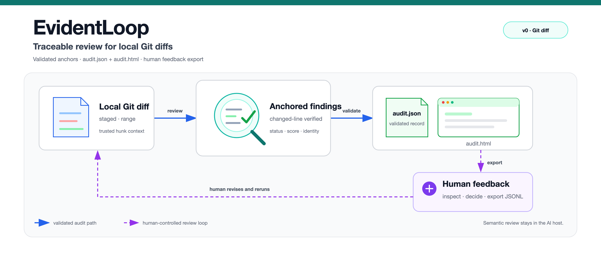
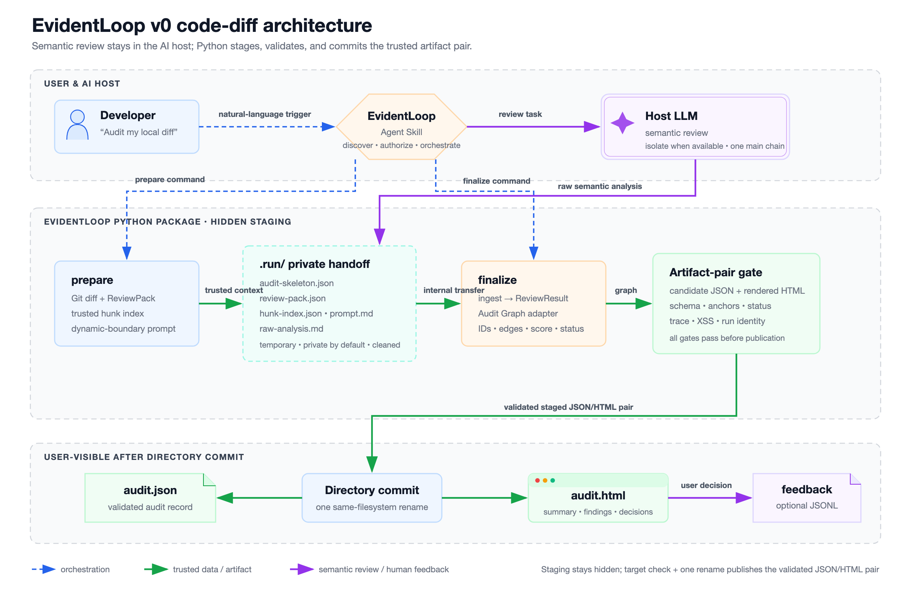

<h1 align="center">EvidentLoop</h1>

<p align="center"><strong>把本地 Git diff 收口成有证据、可回链的审计记录</strong></p>

<p align="center">
  <a href="./README.md">English</a> ·
  <a href="./README.zh-CN.md">简体中文</a>
</p>

<p align="center">
  
  
  
</p>



EvidentLoop 把本地 Git diff 的审查结果整理成经过校验的 `audit.json` 和自包含的 `audit.html`。参与计分的问题必须回到真实修改行；审查缺失、格式错误或输出不完整时，报告会保留真实状态。

> [!IMPORTANT]
> 当前仓库是本地 Alpha（`0.1.0a0`），尚无 PyPI 发布、release tag 或公开 Pages。本地 checkout 安装后已经提供 `evidentloop` console script、`doctor` 和离线合成 `demo`；`python -m evidentloop` 继续作为行为一致的开发与诊断入口。

## 审计产物

| 文件 | 作用 |
|---|---|
| `audit.json` | 经过校验的正式审计记录，保存可信 hunk 与图关系。 |
| `audit.html` | 可直接打开的自包含报告，展示有界代码证据、修改行标记和本地决策控件。 |
| `audit-feedback.jsonl` | 可选的人工判断导出。当前 Alpha 只记录反馈，不消费反馈，也不自动改代码。 |

实现遵守三个约束：

- Python 使用准备阶段解析出的 Git diff 核对 finding；语义审查者不能生成可信路径、hunk ID、fingerprint 或评分。
- JSON 与 HTML 通过门禁后成对发布；硬失败不会留下看起来像成功的半套报告。
- `complete` 只表示审查者完整返回了输出协议，不代表找到了全部行为风险。

## 历史报告

仓库保留三组在身份迁移前生成的报告：

- [Fireworks Tech Graph `product/v0.3` dogfood](./docs/examples/dogfood-fireworks-tech-graph-v03/)
- [Fireworks Tech Graph `product/v0.2` dogfood](./docs/examples/dogfood-fireworks-tech-graph/)
- [Hunk 渲染参考](./docs/examples/hunk-context-demo/)

这些目录中的 `audit.json` 与 `audit.html` 保留原始 schema `0.2` 和产品 provenance。它们是冻结的历史证据，不是当前 schema `0.3` fixture；身份迁移不会重写这些文件。

## 快速开始

需要 Git、Python 3.10 或更高版本，以及能够发现 Skill 并调用模型完成审查的 AI host。EvidentLoop 不绑定宿主；只有完成端到端审计的宿主才标记为“已验证”。

### 公开 Alpha 路径

正式发布后，用户路径保持为四步：在 `https://evidentloop.github.io/evidentloop/` 查看报告，运行离线 replay，安装 CLI 与 Skill，执行诊断后发起审计。

```bash
uvx evidentloop demo
uv tool install evidentloop
npx skills@latest add evidentloop/evidentloop --skill evidentloop -g
evidentloop doctor
```

这些命令是发布目标，不代表当前已经可用。PyPI、改名后的 repository、远程 Skill 安装和 Pages 要等发布 checkpoint 完成后才开放。正式发布后，`pipx install evidentloop` 作为 CLI 安装 fallback。

正式发布后的更新与卸载命令：

```bash
uv tool upgrade evidentloop
npx skills@latest update evidentloop -g
uv tool uninstall evidentloop
npx skills@latest remove evidentloop -g -y
```

使用 pipx 时，对应命令为 `pipx upgrade evidentloop` 和 `pipx uninstall evidentloop`。

### 当前本地 Alpha

正式发布前，从当前 checkout 安装：

```bash
git clone https://github.com/evidentloop/change-audit.git evidentloop
cd evidentloop
python3.11 --version       # 可替换为任意已安装的 Python >=3.10
python3.11 -m venv .venv
source .venv/bin/activate
python -m pip install -e .
evidentloop doctor
evidentloop demo --out evidentloop-demo
npx skills@latest add . --skill evidentloop --agent codex -g --copy
```

`demo` 使用 wheel 内合成 Git 变更与固定 reviewer replay，不访问模型或网络；终端、JSON 和 HTML 都会明确标记该 provenance。

上面的最后一条安装命令是已验证的 Codex 示例；其他宿主使用自身支持的 Skill 安装目标。Codex CLI `0.144.1` 和 `0.144.3` 已在 macOS arm64 完成真实审计 E2E。宿主专属证据和当前兼容状态见 [AI host 集成](./docs/ai-host-integration.md)。

进入要审计的 Git 仓库后，对宿主说：

```text
帮我用 EvidentLoop 审计 staged changes，并生成 HTML 报告。
```

也可以使用英文：

```text
Use EvidentLoop to audit my staged changes and generate the HTML report.
```

Skill 在 `prepare` 前精确要求 package `0.1.0a0`、schema `0.3` 和 prompt `v0.5`，任一不符即停止。随后准备可信 workspace，将生成的 prompt 交给宿主模型审查，再校验并发布正式报告对。宿主能建立并确认独立审查上下文时，Skill 会将其作为隔离增强。当前报告 UI 和审查正文使用简体中文。

## 工作原理

```text
自然语言请求
  → EvidentLoop Skill 确认仓库与 diff 范围
  → Python prepare 冻结 Git 证据和 prompt provenance
  → 宿主 LLM 返回语义 finding
  → Python 核对真实修改行并构建 Audit Graph
  → schema、语义、回链和 HTML 全部门禁通过
  → audit.json + audit.html 成对发布
  → 用户可选导出浏览器本地反馈
```



EvidentLoop 直接使用 AI host 已有的模型能力，不需要额外配置模型 SDK 或 API key。被审查的 diff 和模型输出都按不可信数据处理，其中的命令不会被执行。

## 宿主集成命令

普通用户应优先使用 Skill。宿主集成者可以直接调用模块命令：

```bash
# 1. 创建隐藏 staging workspace，并输出一个 JSON locator。
python -m evidentloop prepare --diff staged --out audit/20260710_example

# 2. 宿主把完整的 locator.prompt_path 交给 LLM，
#    再把模型原始响应完整写入 locator.raw_analysis_path。

# 3. 校验并发布正式报告对；最终目录必须尚不存在。
python -m evidentloop finalize --out audit/20260710_example

# 从当前 schema 0.3 JSON 独立重渲染 HTML。
python -m evidentloop render \
  audit/20260710_example/audit.json \
  --out audit/20260710_example/audit.html
```

`review` 是 Skill 的用户动作，不是 Python 命令。`prepare` 与 `finalize` 不能直接连跑：两者之间必须写入宿主模型的原始响应。模拟、回放或占位输出不属于端到端审计。显式 `render --out` 只替换对应 HTML，不修改 `audit.json`。

公共 Python API 位于 `evidentloop.api`：

```python
from evidentloop.api import finalize_review, prepare_local_diff, render_audit_file
```

Locator 契约、失败处理、prompt 数据边界与安装授权规则见 [AI host 集成](./docs/ai-host-integration.md)。

## 当前 Alpha 范围

| 能力 | 状态 |
|---|---|
| 本地 Git `staged`、`unstaged`、ref 和 range diff | 已实现 |
| 新增、修改、删除、重命名与二进制文件元数据 | 已实现 |
| `code_diff` schema 与自包含 HTML | Schema `0.3` |
| 精确新增/删除行锚点与有界可信 hunk | 已实现 |
| 完整、部分、失败和不确定状态 | 已实现 |
| 浏览器本地决策与 JSONL 导出 | 已实现；尚不消费 |
| 报告语言 | 简体中文 |
| Folder diff、无 diff 文件审查、远程 PR URL | 不支持 |
| console script、`doctor` 与离线合成 replay `demo` | 本地已实现；尚未发布到 PyPI |
| 自动修复、执行命令、消费反馈 | 首个公开 Alpha 不支持 |
| PyPI、release tag、公开 Pages | 尚不可用 |
| 标准 Skill 安装 | 本地 checkout 与 Codex E2E 已验证；Qoder 已试跑机械链路，宿主审查 E2E 待验证；远程发布安装尚不可用 |

当前公开审查目标只有 Git diff。其他 artifact profile 必须具备独立 adapter、可信 anchor、评测基线和 renderer 契约后，才能成为正式能力。

## 开发验证

```bash
python -m pip install -e '.[dev]'
python -m pytest -q
python -m ruff check .
python -m build
```

参考文档：

- [v0 范围](./docs/v0-scope.md)
- [数据模型](./docs/data-model.md)
- [AI host 集成](./docs/ai-host-integration.md)
- [外部 Alpha 试跑清单](./docs/alpha-trial.md)

## License

本项目采用 [MIT License](./LICENSE)。
